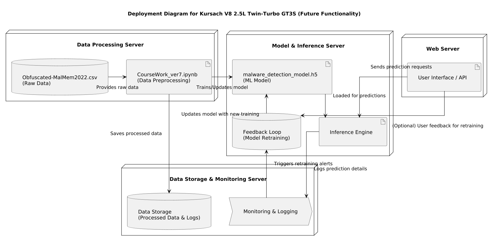

# Future Functionality Component Diagram for Kursach V8 2.5L Twin-Turbo GT3S

This document provides an overview of the system architecture as depicted in the component diagram. The diagram illustrates both the current components and planned future functionalities, focusing on data processing, machine learning model training, inference, and continuous improvement through monitoring and retraining.

## Diagram Overview

The diagram is generated using PlantUML and represents the following key components:

- **Obfuscated-MalMem2022.csv (Raw Data):**
  Represented as a database, this file contains the raw, obfuscated malware data that serves as the initial input to the system.

- **CourseWork_ver7.ipynb (Data Preprocessing):**  
  A component that preprocesses the raw data. It cleans and transforms the data, making it ready for model training.

- **malware_detection_model.h5 (ML Model):**  
  This component represents the machine learning model (stored as an H5 file) that is trained on the preprocessed data.

- **Inference Engine:**  
  Responsible for loading the trained model and providing real-time predictions based on new input data.

- **User Interface / API:**  
  Provides an interface through which users or external systems can send prediction requests and, optionally, feedback for further improvements.

- **Data Storage (Processed Data & Logs):**  
  A component that saves the processed data and logs generated during data preprocessing, useful for audits and further model training.

- **Feedback Loop (Model Retraining):**  
  Depicted as a database, this component handles retraining of the model when triggered by alerts or user feedback, ensuring the model stays up-to-date.

- **Monitoring & Logging:**  
  Represented as a process, this component logs the details of predictions and overall system performance, triggering retraining alerts when necessary.

## Data Flow

The data flows between components are as follows:

1. **Raw Data Ingestion:**  
   - **Obfuscated-MalMem2022.csv** feeds raw data into the **CourseWork_ver7.ipynb** component.

2. **Data Preprocessing:**  
   - The **Notebook** component processes the raw data.
   - Processed data is saved in **Data Storage**.
   - Processed data is also used to train or update the **ML Model**.

3. **Model Training and Inference:**  
   - The **ML Model** is updated/trained using the processed data.
   - The trained model is loaded by the **Inference Engine** to serve predictions.

4. **User Interaction:**  
   - **User Interface / API** sends prediction requests to the **Inference Engine**.
   - Optionally, it also sends user feedback to the **Feedback Loop**.

5. **Monitoring and Feedback Loop:**  
   - The **Inference Engine** logs prediction details to **Monitoring & Logging**.
   - The **Monitoring & Logging** process triggers retraining alerts to the **Feedback Loop**.
   - The **Feedback Loop** updates the **ML Model** with new training based on these alerts and any provided user feedback.

# Deployment Diagram for Kursach V8 2.5L Twin-Turbo GT3S

this document provides an overview of the deployment diagram defined below. the diagram outlines the architecture and data flow for future functionality of the kursach system.

## overview

the diagram comprises four main nodes:
- data processing server
- model & inference server
- data storage & monitoring server
- web server

each node hosts specific components (databases, artifacts, processes) that interact to process raw data, train and update the machine learning model, handle predictions, and manage user interactions.

## components

### data processing server

- **raw data**: `Obfuscated-MalMem2022.csv` (raw data)
- **data preprocessing**: `CourseWork_ver7.ipynb` (data preprocessing)

this node handles initial data processing by reading raw data from the csv file and preprocessing it using the jupyter notebook.

### model & inference server

- **ml model**: `malware_detection_model.h5` (ml model)
- **inference engine**: for generating predictions
- **feedback loop**: a database used for model retraining

this node is responsible for training/updating the model and serving predictions through the inference engine.

### data storage & monitoring server

- **data storage**: stores processed data & logs
- **monitoring & logging**: process that records prediction details

this node saves processed data and logs prediction activity, triggering alerts for model retraining through the feedback loop.

### web server

- **user interface / api**: handles prediction requests and optional user feedback

this node serves as the frontend, enabling users to interact with the system.

## data flow

the data flows through the system as follows:
- the csv file provides raw data to the jupyter notebook
- the notebook saves processed data to the data storage
- the notebook trains/updates the ml model
- the trained model is loaded into the inference engine for predictions
- the user interface sends prediction requests to the inference engine
- the inference engine logs prediction details to the monitoring process
- the monitoring process triggers retraining alerts in the feedback loop
- the feedback loop updates the model with new training data
- optionally, the user interface sends user feedback to the feedback loop

