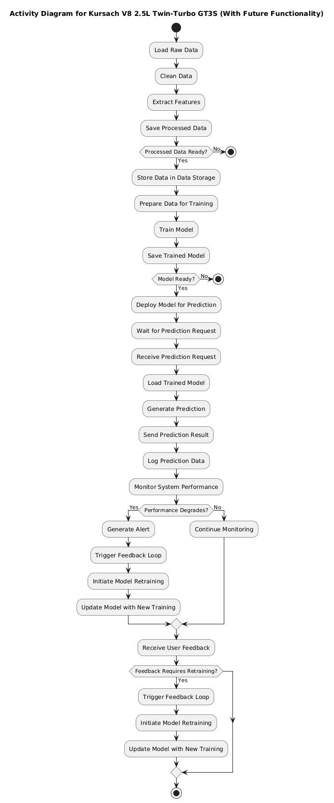
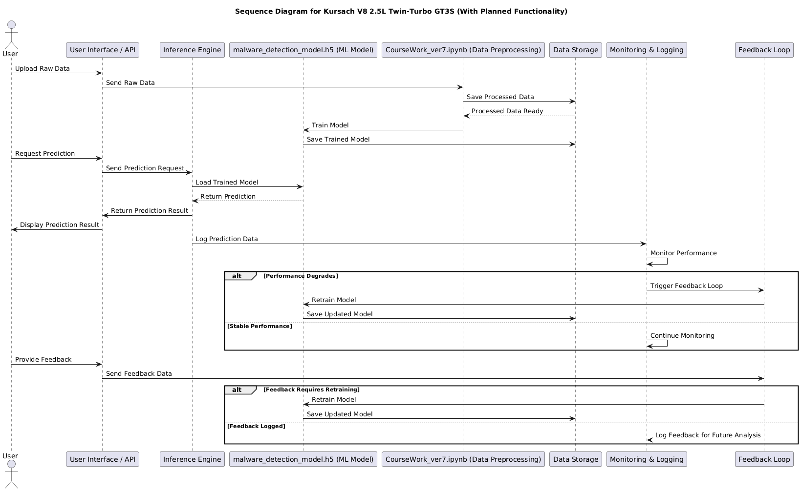
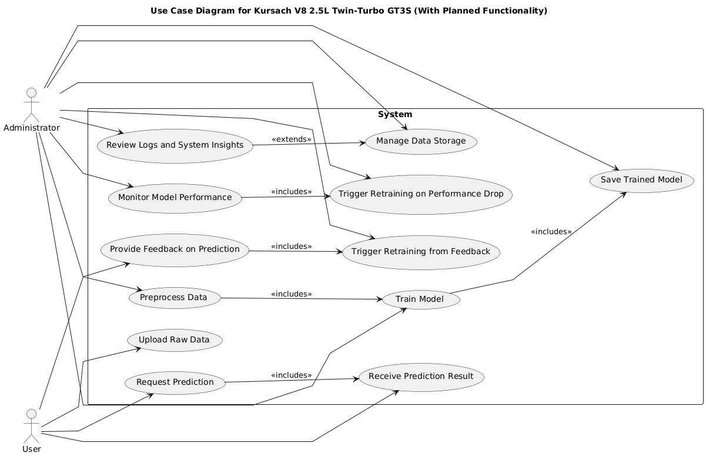

# 1. State and Transition Diagram for Kursach V8 2.5L Twin-Turbo GT3S

This document explains the **State and Transition Diagram** for the Kursach V8 2.5L Twin-Turbo GT3S project, including planned future functionality.

---

## Overview
The state diagram illustrates the various stages that the system goes through during its lifecycle. It includes:

- **Data Ingestion Process**
- **Model Training Process**
- **Inference Process**
- **Monitoring and Feedback Process**

This diagram emphasizes both the main workflow and the future functionality enhancements such as automated monitoring and retraining.

---

## State Descriptions

### **1. Data Ingestion**
This state handles the preparation and preprocessing of raw data before it is sent for model training.

- **`Data_Loading`** → Loads raw data from the source (e.g., CSV file).
- **`Data_Cleaning`** → Cleans the data by handling null values, anomalies, and formatting.
- **`Feature_Extraction`** → Extracts key features relevant to malware detection.
- **`Data_Stored`** → Saves the processed data for later use in training.

> **Transition:** The state moves to `Model_Training` once the processed data is saved.

---

### **2. Model Training**
This state manages the process of training the machine learning model.

- **`Data_Preparation`** → Prepares data by formatting it into model-ready input.
- **`Model_Training_In_Progress`** → The model is actively being trained with the prepared data.
- **`Model_Training_Completed`** → Marks the model as "Ready" for deployment once training is finished.

> **Transition:** The state moves to `Inference_Process` when the model is successfully trained.

---

### **3. Inference Process**
This state handles prediction requests from the User Interface / API.

- **`Awaiting_Requests`** → The system is waiting for incoming prediction requests.
- **`Prediction_In_Progress`** → The system processes data and generates predictions.
- **`Prediction_Completed`** → Sends the prediction results back to the UI/API.

> **Transition:** The system logs the prediction data and moves to `Monitoring_Feedback`.

---

### **4. Monitoring & Feedback**
This state ensures system reliability by tracking performance and triggering retraining when required.

- **`Monitoring_Active`** → Monitors system behavior, prediction accuracy, and overall performance.
- **`Performance_Alert`** → An alert is generated if model performance degrades or anomalies are detected.
- **`Feedback_Triggered`** → Initiates the feedback loop for model retraining.

> **Transition:** Retraining sends data back to `Model_Training`.

---

## System Transitions
### Key Transitions Between States
- **`Data_Ingestion → Model_Training`** → When processed data is saved, the model training process begins.
- **`Model_Training → Inference_Process`** → After successful training, the model is deployed for inference.
- **`Inference_Process → Monitoring_Feedback`** → Logs prediction details for monitoring and quality assurance.
- **`Monitoring_Feedback → Model_Training`** → If performance degrades or user feedback suggests issues, retraining is triggered.

## PlantUML Code:
@startuml
title State and Transition Diagram for Kursach V8 2.5L Twin-Turbo GT3S

[*] --> Data_Ingestion : System Initialized

' ----------------------
' Data Processing States
' ----------------------
state Data_Ingestion {
    [*] --> Data_Loading
    Data_Loading --> Data_Cleaning : Raw Data Loaded
    Data_Cleaning --> Feature_Extraction : Data Cleaned
    Feature_Extraction --> Data_Stored : Features Extracted
    Data_Stored --> [*] : Processed Data Saved
}

' ----------------------
' Model Training States
' ----------------------
state Model_Training {
    [*] --> Data_Preparation
    Data_Preparation --> Model_Training_In_Progress : Data Ready
    Model_Training_In_Progress --> Model_Training_Completed : Model Trained
    Model_Training_Completed --> [*] : Model Ready
}

' ----------------------
' Inference States
' ----------------------
state Inference_Process {
    [*] --> Awaiting_Requests
    Awaiting_Requests --> Prediction_In_Progress : Prediction Request Received
    Prediction_In_Progress --> Prediction_Completed : Prediction Made
    Prediction_Completed --> [*] : Results Sent to UI
}

' ----------------------
' Monitoring and Feedback Loop
' ----------------------
state Monitoring_Feedback {
    [*] --> Monitoring_Active
    Monitoring_Active --> Performance_Alert : Performance Degradation Detected
    Performance_Alert --> Feedback_Triggered : Feedback Triggered
    Feedback_Triggered --> Model_Training_In_Progress : Model Retraining
}

' ----------------------
' System Transitions
' ----------------------
Data_Ingestion --> Model_Training : Processed Data Ready
Model_Training --> Inference_Process : Model Deployed
Inference_Process --> Monitoring_Feedback : Log Data Captured
Monitoring_Feedback --> Model_Training : Retraining Triggered
Monitoring_Feedback --> [*] : System Stable

@enduml

---
The diagram integrates key future functionalities to improve system performance and scalability:
✅ **Automated Monitoring** to track prediction accuracy and detect performance degradation.  
✅ **Feedback Loop** for automatic model retraining based on performance metrics or user feedback.  
✅ **Data Flow Optimization** ensures data consistency throughout the pipeline.  
✅ **System Stability Focus** distinguishes stable states from those requiring intervention.

---
This state and transition diagram effectively illustrates the data flow, training pipeline, prediction process, and system monitoring of the **Kursach V8 2.5L Twin-Turbo GT3S** project. The inclusion of future functionality ensures the system remains adaptive and efficient over time.

For developers, this diagram provides a clear roadmap for integrating additional functionality while maintaining robust system behavior.

# 2. Activity Diagram for Kursach V8 2.5L Twin-Turbo GT3S (With Planned Functionality)

This document explains the **Activity Diagram** for the **Kursach V8 2.5L Twin-Turbo GT3S** project, including core functionalities and planned future enhancements. The diagram outlines the system’s workflow, from data processing to prediction, with an integrated monitoring and feedback loop for continuous improvement.

---

## Overview
The diagram captures the following key processes:
- **Data Ingestion Process**
- **Model Training Process**
- **Prediction Process**
- **Monitoring and Feedback Loop**
- **User Feedback Integration**

This structured approach ensures clarity in system behavior and enables efficient maintenance and scaling.

---

## Detailed Explanation of Each Process

### **1. Data Ingestion Process**
This phase involves preparing the raw malware data before sending it to model training.

- **Load Raw Data:**  
   Imports data from the `.csv` file or other data sources.
- **Clean Data:**  
   Cleans the data by handling missing values, removing noise, and normalizing data for consistency.
- **Extract Features:**  
   Identifies and extracts relevant features required for training the machine learning model.
- **Save Processed Data:**  
   Stores the processed data for future use in both training and prediction.

> **Decision Point:**  
If processed data is successfully prepared, it’s saved in the data storage system. Otherwise, the process stops.

---

### **2. Model Training Process**
This phase trains the malware detection model using processed data.

- **Prepare Data for Training:**  
   Organizes and structures data to align with model training requirements.
- **Train Model:**  
   Executes the machine learning model training process.
- **Save Trained Model:**  
   Stores the trained model for later use during inference.

> **Decision Point:**  
If the model is successfully trained, it is deployed for prediction. Otherwise, the process stops.

---

### **3. Prediction Process**
This stage handles the model's deployment for real-time prediction.

- **Wait for Prediction Request:**  
   The system remains idle until it receives a request from the UI/API.
- **Receive Prediction Request:**  
   Captures prediction requests sent by users or applications.
- **Load Trained Model:**  
   Loads the latest trained model to perform prediction.
- **Generate Prediction:**  
   Uses the loaded model to predict malware behavior or characteristics.
- **Send Prediction Result:**  
   Sends the generated result to the UI/API for user visibility.

> **Logging Predictions:**  
The system logs prediction data to support performance analysis and monitoring.

---

### **4. Monitoring and Feedback Loop**
The monitoring system ensures the model's performance remains stable and optimal.

- **Monitor System Performance:**  
   Tracks prediction accuracy, latency, and system stability.
- **Performance Degrades? (Decision Point):**  
   - If **YES**, an alert is triggered, prompting retraining.
   - If **NO**, the system continues monitoring without further action.
- **Generate Alert:**  
   Notifies the system that the model’s performance has degraded.
- **Trigger Feedback Loop:**  
   Initiates the retraining process to improve model performance.
- **Initiate Model Retraining:**  
   Launches the model retraining process using updated data.
- **Update Model with New Training:**  
   Replaces the previous model with the newly trained one.

---

### **5. User Feedback Integration**
User feedback plays a crucial role in improving model accuracy and reliability.

- **Receive User Feedback:**  
   Captures user feedback indicating incorrect or suspicious predictions.
- **Feedback Requires Retraining? (Decision Point):**  
   - If **YES**, the feedback triggers model retraining.
   - If **NO**, the feedback is logged for future analysis.

---

## Key Future Functionalities Integrated
✅ **Automated Performance Monitoring:** Ensures degraded performance is automatically detected.  
✅ **Feedback Loop for Model Improvement:** Ensures real-time adaptation to data changes.  
✅ **Data Storage Optimization:** Ensures processed data and logs are archived securely for auditing and retraining.  
✅ **Continuous System Tracking:** Maintains system reliability and prediction accuracy.  
✅ **User Feedback Handling:** Ensures system behavior evolves to improve accuracy based on user insights.

---

## Key Transition Points
- **Processed Data Ready?** — Ensures data meets quality standards before proceeding to model training.
- **Model Ready?** — Ensures only stable and optimized models are deployed for inference.
- **Performance Degrades?** — Automatically triggers model retraining when performance issues are detected.
- **Feedback Requires Retraining?** — Ensures the system adapts to changing data patterns or user insights.

---

## PlantUML Code:
@startuml
title Activity Diagram for Kursach V8 2.5L Twin-Turbo GT3S (With Planned Functionality)

start

' ---------------------------
' Data Ingestion Process
' ---------------------------
:Load Raw Data;
:Clean Data;
:Extract Features;
:Save Processed Data;

' Decision for Data Flow
if (Processed Data Ready?) then (Yes)
    :Store Data in Data Storage;
else (No)
    stop
endif

' ---------------------------
' Model Training Process
' ---------------------------
:Prepare Data for Training;
:Train Model;
:Save Trained Model;

' Decision for Model Readiness
if (Model Ready?) then (Yes)
    :Deploy Model for Prediction;
else (No)
    stop
endif

' ---------------------------
' Inference Process
' ---------------------------
:Wait for Prediction Request;
:Receive Prediction Request;
:Load Trained Model;
:Generate Prediction;
:Send Prediction Result;

' Logging Predictions for Monitoring
:Log Prediction Data;

' ---------------------------
' Monitoring and Feedback Loop
' ---------------------------
:Monitor System Performance;
if (Performance Degrades?) then (Yes)
    :Generate Alert;
    :Trigger Feedback Loop;
    :Initiate Model Retraining;
    :Update Model with New Training;
else (No)
    :Continue Monitoring;
endif

' ---------------------------
' User Feedback Integration
' ---------------------------
:Receive User Feedback;
if (Feedback Requires Retraining?) then (Yes)
    :Trigger Feedback Loop;
    :Initiate Model Retraining;
    :Update Model with New Training;
endif

stop

@enduml

This detailed **Activity Diagram** effectively visualizes the workflow of your **Kursach V8 2.5L Twin-Turbo GT3S** project. By combining data processing, training, prediction, and monitoring, this diagram reflects a robust and scalable system architecture.

With planned functionality like automated monitoring, feedback handling, and retraining, this system is designed to stay adaptive, efficient, and high-performing over time.

# Sequence Diagram for Kursach V8 2.5L Twin-Turbo GT3S (With Planned Functionality)

This document provides a detailed explanation of the **Sequence Diagram** for the **Kursach V8 2.5L Twin-Turbo GT3S** project. The diagram outlines the system's interactions across its core functionalities while integrating planned improvements such as performance monitoring and user feedback-driven retraining.

---

## Overview
This sequence diagram visualizes interactions between the system’s core components:

- **Data Ingestion Process**
- **Model Training Process**
- **Prediction Process**
- **Monitoring and Feedback Process**
- **User Feedback Integration**

The diagram illustrates the flow of data, interactions between system components, and key decision points for system adaptability.

---

## Detailed Process Breakdown

### **1. Data Ingestion Process**
This phase outlines the process of preparing data before model training.

- **User Uploads Data:**  
   The **User** submits raw malware data through the **UI**.
- **Data Preprocessing:**  
   The **Notebook** processes the raw data by:
   - Cleaning the data
   - Extracting features
   - Preparing it for model training
- **Data Storage:**  
   The processed data is saved in the **Storage** system to ensure availability for both training and future reference.
- **Model Training:**  
   The **Notebook** sends the processed data to the **Model** component for training.
- **Saving Trained Model:**  
   The newly trained model is stored in the **Storage** system for deployment.

---

### **2. Prediction Process**
This phase manages the model's prediction workflow.

- **User Requests Prediction:**  
   The **User** submits a prediction request through the **UI**.
- **Inference Process:**  
   The **Inference Engine** retrieves the trained model from the **Model** component and generates predictions based on the input data.
- **Result Delivery:**  
   The prediction result is sent back to the **UI** for the user to review.

---

### **3. Monitoring and Feedback Process**
This phase ensures the model's performance remains optimal.

- **Prediction Logging:**  
   Each prediction's result is logged in the **Monitoring & Logging** system for analysis.
- **Monitoring:**  
   The **Monitor** continuously tracks system performance to detect performance degradation.
- **Performance Alert (Decision Point):**  
   - If performance issues are detected, the **Monitor** triggers the **Feedback Loop** for model retraining.
   - If performance remains stable, monitoring continues without intervention.
- **Model Retraining:**  
   The **Feedback Loop** retrains the model using updated data, and the improved model is saved back to the **Storage** system.

---

### **4. User Feedback Integration**
This phase leverages user insights to improve model performance.

- **User Feedback Submission:**  
   Users can submit feedback through the **UI** if they identify incorrect predictions or inconsistencies.
- **Feedback Analysis (Decision Point):**  
   - If feedback indicates that retraining is necessary, the **Feedback Loop** initiates model retraining.
   - If retraining is not required, the feedback is logged for future reference.

---

## Key Decision Points
Several decision points guide the system’s adaptive behavior:

- **Processed Data Ready?** — Ensures data quality before proceeding to model training.  
- **Model Ready?** — Ensures only successfully trained models are deployed for prediction.  
- **Performance Degrades?** — Triggers automated retraining if performance drops.  
- **Feedback Requires Retraining?** — Determines if user feedback necessitates immediate retraining or if it should be logged for future analysis.  

---

## Key Planned Functionalities Integrated
✅ **Automated Monitoring:** Ensures system performance is tracked in real-time, with automated alerts for degraded performance.  
✅ **Feedback Loop for Retraining:** Combines system alerts and user insights to trigger model retraining when necessary.  
✅ **User Feedback Handling:** Ensures the system can adapt to real-world insights provided by users.  
✅ **Data Storage Optimization:** Ensures processed data, trained models, and logs are securely archived for analysis and future improvements.  

---

## Why Does This Version Exclude Object Lifetimes?
- **Improved Clarity:** Removing activation bars enhances readability for a broader audience, including non-technical stakeholders.  
- **Focus on Core Logic:** The simplified design emphasizes system logic, data flow, and key interactions without unnecessary complexity.  
- **Efficient Visualization:** With fewer visual elements, the diagram is concise yet informative.  

This refined **Sequence Diagram** effectively visualizes the interactions between system components and the flow of data through the system. By removing object lifetimes and focusing on streamlined interactions, the diagram presents a clear, concise view of both the system’s core workflow and planned improvements.

## 4. Use Case Diagram
# Use Case Diagram for Kursach V8 2.5L Twin-Turbo GT3S

This document explains the **Use Case Diagram** for the **Kursach V8 2.5L Twin-Turbo GT3S** project. The diagram outlines the system's core functionalities along with planned enhancements, designed with smooth rounded lines to improve readability and ensure a professional visual flow.

---

## Overview
The **Use Case Diagram** illustrates the interactions between system actors and key functionalities. It combines:

✅ **Core Functionalities** — Essential processes for data ingestion, model training, and prediction.  
✅ **Planned Future Enhancements** — Advanced features like automated monitoring, retraining triggers, and user feedback integration.  
✅ **Improved Visual Flow** — Rounded lines for cleaner and clearer connections.

---

## Actors
### **1. User**
The **User** interacts with the system primarily through the **User Interface (UI)/API** for data submission, prediction requests, and feedback.

### **2. Administrator**
The **Administrator** manages core system functionalities like data preprocessing, model training, performance monitoring, and data storage.

---

## Core Use Cases (Current Functionality)
✅ **Upload Raw Data:** Users submit malware data for analysis.  
✅ **Preprocess Data:** Admins clean, transform, and extract features from raw data.  
✅ **Train Model:** Admins train the malware detection model.  
✅ **Save Trained Model:** Admins store the trained model for prediction.  
✅ **Request Prediction:** Users request predictions via the UI/API.  
✅ **Receive Prediction Result:** Users receive prediction results after submission.

---

## Planned Future Functionalities
✅ **Monitor Model Performance:** Admins track model performance metrics to detect accuracy degradation.  
✅ **Trigger Retraining on Performance Drop:** Admins initiate retraining when performance issues arise.  
✅ **Provide Feedback on Prediction:** Users provide feedback regarding prediction quality.  
✅ **Trigger Retraining from Feedback:** Admins or automated logic initiate retraining based on user feedback.  
✅ **Review Logs and System Insights:** Admins review system logs and model insights for performance analysis.  
✅ **Manage Data Storage:** Admins control data archiving and retrieval to ensure organized data management.

## Use Case Relationships
### **Includes Relationships**  
- **`Preprocess Data` → `Train Model` (<<includes>>):** Data must be processed before model training.  
- **`Train Model` → `Save Trained Model` (<<includes>>):** Saving the model follows immediately after training.  
- **`Request Prediction` → `Receive Prediction Result` (<<includes>>):** Prediction requests naturally lead to results.  
- **`Monitor Model Performance` → `Trigger Retraining on Performance Drop` (<<includes>>):** Retraining is triggered when performance issues are detected.  
- **`Provide Feedback on Prediction` → `Trigger Retraining from Feedback` (<<includes>>):** Critical feedback can initiate model retraining.  

### **Extends Relationships**  
- **`Review Logs and System Insights` → `Manage Data Storage` (<<extends>>):** Reviewing insights may suggest adjustments to data storage strategies.

## Conclusion
This **Use Case Diagram** effectively visualizes the key interactions and system behavior for the **Kursach V8 2.5L Twin-Turbo GT3S** project. By incorporating smooth rounded lines, it offers a clearer, more visually appealing structure that highlights both current features and planned improvements.

