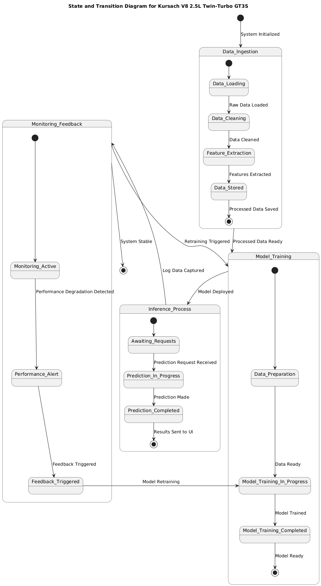

# State and Transition Diagram for Kursach V8 2.5L Twin-Turbo GT3S

This document explains the **State and Transition Diagram** for the Kursach V8 2.5L Twin-Turbo GT3S project, including planned future functionality.

---

## Overview
The state diagram illustrates the various stages that the system goes through during its lifecycle. It includes:

- **Data Ingestion Process**
- **Model Training Process**
- **Inference Process**
- **Monitoring and Feedback Process**

This diagram emphasizes both the main workflow and the future functionality enhancements such as automated monitoring and retraining.

---

## State Descriptions

### **1. Data Ingestion**
This state handles the preparation and preprocessing of raw data before it is sent for model training.

- **`Data_Loading`** → Loads raw data from the source (e.g., CSV file).
- **`Data_Cleaning`** → Cleans the data by handling null values, anomalies, and formatting.
- **`Feature_Extraction`** → Extracts key features relevant to malware detection.
- **`Data_Stored`** → Saves the processed data for later use in training.

> **Transition:** The state moves to `Model_Training` once the processed data is saved.

---

### **2. Model Training**
This state manages the process of training the machine learning model.

- **`Data_Preparation`** → Prepares data by formatting it into model-ready input.
- **`Model_Training_In_Progress`** → The model is actively being trained with the prepared data.
- **`Model_Training_Completed`** → Marks the model as "Ready" for deployment once training is finished.

> **Transition:** The state moves to `Inference_Process` when the model is successfully trained.

---

### **3. Inference Process**
This state handles prediction requests from the User Interface / API.

- **`Awaiting_Requests`** → The system is waiting for incoming prediction requests.
- **`Prediction_In_Progress`** → The system processes data and generates predictions.
- **`Prediction_Completed`** → Sends the prediction results back to the UI/API.

> **Transition:** The system logs the prediction data and moves to `Monitoring_Feedback`.

---

### **4. Monitoring & Feedback**
This state ensures system reliability by tracking performance and triggering retraining when required.

- **`Monitoring_Active`** → Monitors system behavior, prediction accuracy, and overall performance.
- **`Performance_Alert`** → An alert is generated if model performance degrades or anomalies are detected.
- **`Feedback_Triggered`** → Initiates the feedback loop for model retraining.

> **Transition:** Retraining sends data back to `Model_Training`.

---

## System Transitions
### Key Transitions Between States
- **`Data_Ingestion → Model_Training`** → When processed data is saved, the model training process begins.
- **`Model_Training → Inference_Process`** → After successful training, the model is deployed for inference.
- **`Inference_Process → Monitoring_Feedback`** → Logs prediction details for monitoring and quality assurance.
- **`Monitoring_Feedback → Model_Training`** → If performance degrades or user feedback suggests issues, retraining is triggered.

## PlantUML Code:
@startuml
title State and Transition Diagram for Kursach V8 2.5L Twin-Turbo GT3S

[*] --> Data_Ingestion : System Initialized

' ----------------------
' Data Processing States
' ----------------------
state Data_Ingestion {
    [*] --> Data_Loading
    Data_Loading --> Data_Cleaning : Raw Data Loaded
    Data_Cleaning --> Feature_Extraction : Data Cleaned
    Feature_Extraction --> Data_Stored : Features Extracted
    Data_Stored --> [*] : Processed Data Saved
}

' ----------------------
' Model Training States
' ----------------------
state Model_Training {
    [*] --> Data_Preparation
    Data_Preparation --> Model_Training_In_Progress : Data Ready
    Model_Training_In_Progress --> Model_Training_Completed : Model Trained
    Model_Training_Completed --> [*] : Model Ready
}

' ----------------------
' Inference States
' ----------------------
state Inference_Process {
    [*] --> Awaiting_Requests
    Awaiting_Requests --> Prediction_In_Progress : Prediction Request Received
    Prediction_In_Progress --> Prediction_Completed : Prediction Made
    Prediction_Completed --> [*] : Results Sent to UI
}

' ----------------------
' Monitoring and Feedback Loop
' ----------------------
state Monitoring_Feedback {
    [*] --> Monitoring_Active
    Monitoring_Active --> Performance_Alert : Performance Degradation Detected
    Performance_Alert --> Feedback_Triggered : Feedback Triggered
    Feedback_Triggered --> Model_Training_In_Progress : Model Retraining
}

' ----------------------
' System Transitions
' ----------------------
Data_Ingestion --> Model_Training : Processed Data Ready
Model_Training --> Inference_Process : Model Deployed
Inference_Process --> Monitoring_Feedback : Log Data Captured
Monitoring_Feedback --> Model_Training : Retraining Triggered
Monitoring_Feedback --> [*] : System Stable

@enduml

---
The diagram integrates key future functionalities to improve system performance and scalability:
✅ **Automated Monitoring** to track prediction accuracy and detect performance degradation.  
✅ **Feedback Loop** for automatic model retraining based on performance metrics or user feedback.  
✅ **Data Flow Optimization** ensures data consistency throughout the pipeline.  
✅ **System Stability Focus** distinguishes stable states from those requiring intervention.

---
This state and transition diagram effectively illustrates the data flow, training pipeline, prediction process, and system monitoring of the **Kursach V8 2.5L Twin-Turbo GT3S** project. The inclusion of future functionality ensures the system remains adaptive and efficient over time.

For developers, this diagram provides a clear roadmap for integrating additional functionality while maintaining robust system behavior.
